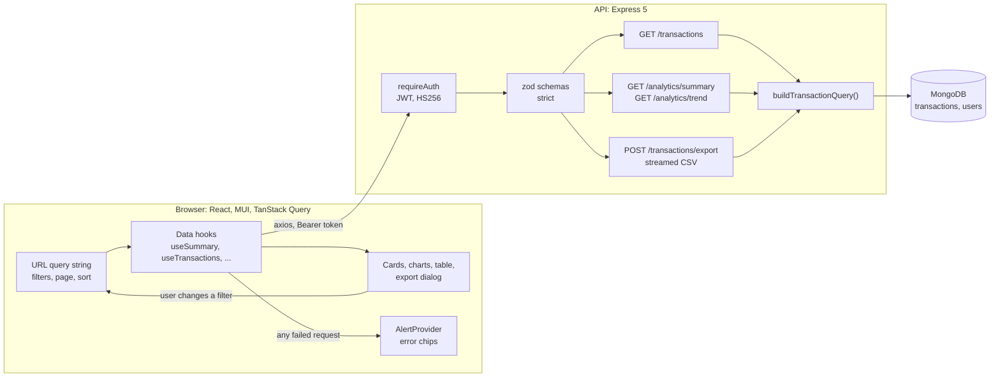

# Ledgerline

A financial analytics dashboard for company transactions:

- JWT login;
- a searchable, filterable, sortable transaction table;
- revenue and expense charts;
- CSV exports where you choose the columns.

React, TypeScript and MUI in the browser; Express and MongoDB on the server.

Ledgerline was built for a full-stack hiring assignment. The brief itself isn't committed; the [requirements table](#requirements-and-where-they-are-implemented) below lists what it asks for and where each part is implemented.

- [Quick start](#quick-start)
- [Requirements and where they are implemented](#requirements-and-where-they-are-implemented)
- [Architecture](#architecture)
- [Design decisions](#design-decisions)
- [Security](#security)
- [Data model and indexes](#data-model-and-indexes)
- [API](#api)
- [Configuration](#configuration)
- [Seeding](#seeding)
- [Scripts and tests](#scripts-and-tests)
- [Project structure](#project-structure)
- [Known issues and next steps](#known-issues-and-next-steps)
- [How this was built](#how-this-was-built)

## Quick start

You need **Node.js 20.19 or later** (22 LTS recommended), **npm 10+**, and a **MongoDB 5.0+ connection string**. An Atlas free-tier cluster works, and so does a local `mongod`.

```bash
npm install
cp server/.env.example server/.env    # PowerShell: Copy-Item server/.env.example server/.env
```

Edit `server/.env` and set these four values:

- `MONGODB_URI`
- `JWT_SECRET`, generated with `node -e "console.log(require('crypto').randomBytes(48).toString('base64url'))"`
- `DEMO_USER_EMAIL`
- `DEMO_USER_PASSWORD`

Then:

```bash
npm run seed    # loads the 300 sample transactions, creates the demo login, checks the totals
npm run dev     # API on port 4000, app on http://localhost:5173
```

Open http://localhost:5173 and sign in with the `DEMO_USER_EMAIL` and `DEMO_USER_PASSWORD` you chose.

- **Atlas users:** add your IP address under _Network Access_. Otherwise the server and the seed exit after 10 seconds with a `MongooseServerSelectionError`.
- **First test run:** `npm test` downloads a MongoDB binary for the test database, about 780 MB, once. `npm install` never downloads it.

## Requirements and where they are implemented

| Brief requirement                                            | Implementation                                                                                                                                                                                                                                                                                                             |
| ------------------------------------------------------------ | -------------------------------------------------------------------------------------------------------------------------------------------------------------------------------------------------------------------------------------------------------------------------------------------------------------------------- |
| JWT login and logout                                         | `POST /api/auth/login` ([auth.service.ts](server/src/services/auth.service.ts), [token.service.ts](server/src/services/token.service.ts)). The client session and sign-out live in [AuthProvider.tsx](client/src/providers/AuthProvider.tsx). Logout is client-side (see [Security](#security)).                           |
| Secure API endpoints with token validation                   | [requireAuth](server/src/middleware/requireAuth.ts) protects every data route. On the client, any 401 ends the session and redirects to the login page ([http.ts](client/src/api/http.ts)).                                                                                                                                |
| Revenue vs expenses trend                                    | The Overview chart ([OverviewChart.tsx](client/src/components/dashboard/OverviewChart.tsx)), fed by `GET /api/analytics/trend`.                                                                                                                                                                                            |
| Category breakdowns                                          | The category donut and the paid/pending split ([BreakdownPanels.tsx](client/src/components/dashboard/BreakdownPanels.tsx)), fed by `GET /api/analytics/summary`.                                                                                                                                                           |
| Summary metrics                                              | Balance, Revenue, Expenses and Pending cards ([KpiCards.tsx](client/src/components/dashboard/KpiCards.tsx)).                                                                                                                                                                                                               |
| Paginated table, responsive design                           | Server-side paging with 10, 25 or 50 rows per page ([TransactionsResults.tsx](client/src/components/transactions/TransactionsResults.tsx)). On narrow screens the table scrolls sideways, the toolbar wraps and the sidebar collapses to icons.                                                                            |
| Filters: date, amount, category, status, user                | The date range popover and the Filters popover ([components/transactions/](client/src/components/transactions/)) write to the URL ([useTransactionFilters.ts](client/src/hooks/useTransactionFilters.ts)). The server turns them into a query with [buildTransactionQuery()](server/src/queries/buildTransactionQuery.ts). |
| Column sorting with visual indicators                        | Sortable headers with a direction arrow ([TransactionsTable.tsx](client/src/components/transactions/TransactionsTable.tsx)). Sort fields are whitelisted on the server ([buildTransactionSort.ts](server/src/queries/buildTransactionSort.ts)).                                                                            |
| Real-time search                                             | Search runs 300 ms after the last keystroke, and `/` focuses the box ([SearchField.tsx](client/src/components/transactions/SearchField.tsx)). The server matches with an escaped, case-insensitive regex.                                                                                                                  |
| Error handling with alert chips                              | One global React Query error handler ([queryClient.ts](client/src/api/queryClient.ts)) passes every failed request to [AlertProvider](client/src/providers/AlertProvider.tsx).                                                                                                                                             |
| CSV export: choose the columns, file downloads automatically | The export dialog ([components/export/](client/src/components/export/)) builds its column list from the server's whitelist. `POST /api/transactions/export` streams the CSV, and the browser saves it under the server's filename.                                                                                         |
| RESTful APIs with proper authentication                      | [docs/API.md](docs/API.md) documents every endpoint, its parameters, responses and error codes, with examples.                                                                                                                                                                                                             |
| MongoDB integration with optimized queries                   | An index per query pattern ([transaction.model.ts](server/src/models/transaction.model.ts)), `$group` aggregations for analytics, and the page and total count fetched in parallel. See [Data model and indexes](#data-model-and-indexes).                                                                                 |
| CSV generation with configurable columns                     | A MongoDB cursor feeds csv-stringify ([export.service.ts](server/src/services/export.service.ts), [csvFormat.ts](server/src/services/csvFormat.ts)). Columns are whitelisted, the header row is always written, and formula characters are escaped.                                                                        |

## Architecture



- **The URL is the only filter state.** The cards, charts, table and export dialog all read the same query string, through `useTransactionFilters()`. They can't disagree, a filtered view can be bookmarked or shared, and Back undoes a filter change.
- **One query builder.** `buildTransactionQuery()` is a pure function from validated filters to a MongoDB query. The list, analytics and export endpoints all call it, so a filter can't mean one thing in the table and another in a chart or a CSV. It has full unit-test coverage, and integration tests check over HTTP that all three return the same rows.
- **The server has three layers:** routes, then controllers, then services. Routes only wire middleware. Controllers validate the input with zod and shape the response. Services and the pure query and transform functions do the work.
- **One error shape:** `{ error: { code, message, details? } }`, produced by a single [error handler](server/src/middleware/errorHandler.ts). The client turns every failure into an `ApiError` in one place ([errors.ts](client/src/api/errors.ts)).

## Design decisions

- **The server does all filtering, searching, sorting and paging.** The browser never downloads rows just to filter them.
- **Dates are UTC days, inclusive.** `dateTo=2024-03-31` includes the whole of 31 March. The server filters and groups by UTC, and the client displays UTC, so a transaction never shows up on a different day than the filter says.
- **Amounts are stored as positive numbers.** The category supplies the sign: revenue shows as a green `+`, expenses as a yellow `−`.
- **Every date in the data is in 2024**, so the default date filter is "All time". A "last 30 days" default would open on an empty dashboard. The date presets are built from the years the data covers.
- **Balance is revenue minus expenses.** The design's fourth card, "Savings", has no data behind it, so it shows the pending total instead.
- **Avatars show initials.** The data's `user_profile` URL returns a different random face on every request, so it can't identify anyone. The URL is still stored and can be exported.
- **Export is a POST, downloaded as a blob.** The token travels in the `Authorization` header, which a plain link can't carry. The request body carries the chosen columns, the filters and the sort. The preview shows values exactly as they will appear in the file.
- **Search matches user, category and status as text, and ID or amount only as whole numbers.** The placeholder says exactly that. Dates aren't searchable; the date range filter covers them.
- **Money and date formats are set in one file,** [client/src/config/locale.ts](client/src/config/locale.ts) (`en-US`, `USD`).
- **Deviations from the Figma design:**
  - The search box sits in the table header, next to the filters it works with, instead of in the top bar.
  - The trend chart is monthly only, so there is no Monthly/Weekly dropdown.
  - Amounts show cents.
  - Buttons use dark text on green, because white text on `#1FCB4F` fails WCAG contrast.
  - The login page, the breakdown panels and the filtered-view notice aren't in the design. They're built in the same visual style.
  - The colours are sampled from the design's colour styles, and components read them only through the MUI theme ([tokens.ts](client/src/theme/tokens.ts)).

## Security

- **Tokens:** JWTs signed with HS256 that expire after `JWT_EXPIRES_IN` (8 hours by default). The only claim is the user id. Verification is pinned to HS256, so `alg: none` and algorithm-swap tokens are rejected.
- **Each request looks the user up,** so deleting a user cuts off their access immediately.
- **Expired sessions are reported separately:** an expired token gets `TOKEN_EXPIRED`, distinct from `UNAUTHORIZED`, so the client can say the session has ended.
- **Login doesn't reveal which accounts exist.** An unknown email and a wrong password get the same message and take the same time, because an unknown email is still checked against a dummy bcrypt hash.
- **Rate limit:** 10 failed logins per 15 minutes per IP address. Successful logins don't count.
- **Every request is validated** by a strict zod schema, and unknown parameters are rejected. Search input is regex-escaped. Sort fields and export columns are whitelisted.
- **Exported CSVs are safe to open in a spreadsheet.** A cell that starts with `=`, `+`, `-` or `@` is prefixed with an apostrophe, so a spreadsheet can't run it as a formula.
- **Passwords** are hashed with bcrypt (cost 12). The hash is never returned by a query unless the code asks for it explicitly.
- **API responses** get helmet's headers, and CORS allows only `CLIENT_ORIGIN`.
- **The token is kept in `localStorage`,** so it survives a reload. The trade-off is that any script running on the page could read it. The main defence is the Content Security Policy in the production build ([vite.config.ts](client/vite.config.ts)), which allows scripts only from the app's own origin: no inline scripts and no third-party scripts. The 8-hour expiry limits the damage if a token does leak. The dev server runs without the CSP, because React Fast Refresh needs an inline script.
- **The server won't start with the placeholder `JWT_SECRET`** from `.env.example`. That value is public, so anyone could forge tokens with it.
- **Logout is client-side.** Server-side revocation would need a denylist checked on every request. [auth.routes.ts](server/src/routes/auth.routes.ts) explains what that would take, and why it isn't worth it for an 8-hour token here.

## Data model and indexes

**`transactions`:**

- `id`: number, unique. The source id, kept separate from MongoDB's `_id`.
- `date`: Date.
- `amount`: always positive.
- `category`: `Revenue` or `Expense`.
- `status`: `Paid` or `Pending`.
- `user_id`, `user_profile`: strings.

**`users`:** `email` (unique, stored lowercase), `passwordHash` (never selected by default) and `name`.

| Index                                    | Query it serves                                                                         |
| ---------------------------------------- | --------------------------------------------------------------------------------------- |
| `transactions { id: 1 }` unique          | Seed upserts by id; a numeric search term matches an id exactly                         |
| `transactions { date: -1, id: -1 }`      | Default sort (newest first, id breaks ties); latest transactions; date-range filters    |
| `transactions { user_id: 1, date: -1 }`  | User filter with the default date sort                                                  |
| `transactions { status: 1, date: -1 }`   | Status filter with the default date sort; the pending total                             |
| `transactions { category: 1, date: -1 }` | Category filter with the default date sort; revenue and expense totals; the trend chart |
| `transactions { amount: 1, id: 1 }`      | Amount range filter and amount sort                                                     |
| `users { email: 1 }` unique              | Login lookup                                                                            |

- **These indexes are sized for real data volumes.** At 300 rows any query is fast without them. They are chosen for the same queries on millions of rows, where avoiding a sort done in memory matters most.
- **The filter field leads each index, then `date`.** MongoDB can then jump straight to the matching rows and read them in date order, without a separate sort.
- **`category` and `status` never get an index of their own.** Each has only two values, so an index on one alone would still match half the collection. Paired with `date`, it removes the sort.
- **`id` breaks ties** in the date and amount indexes. Rows with equal values then come back in a stable order, so paging never repeats or skips a row.
- **Search can't use an index.** It's a case-insensitive "contains" match. A text index would only match whole words (`user_00` wouldn't find `user_001`), and at this size a collection scan is fine.

## API

Every endpoint lives under `/api`. The full reference, with request and response examples, is in [docs/API.md](docs/API.md).

| Method | Path                               | Auth | Purpose                                                  |
| ------ | ---------------------------------- | ---- | -------------------------------------------------------- |
| GET    | `/api/health`                      | –    | API and database status                                  |
| POST   | `/api/auth/login`                  | –    | Email and password in, token out (rate-limited)          |
| GET    | `/api/auth/me`                     | JWT  | The current user                                         |
| GET    | `/api/transactions`                | JWT  | One page of filtered, searched, sorted transactions      |
| GET    | `/api/transactions/filter-options` | JWT  | Valid filter values and the data's date and amount range |
| GET    | `/api/transactions/export/columns` | JWT  | The export column whitelist and CSV header labels        |
| POST   | `/api/transactions/export`         | JWT  | A streamed CSV of the chosen columns and filters         |
| GET    | `/api/analytics/summary`           | JWT  | Totals, and the splits by category and status            |
| GET    | `/api/analytics/trend`             | JWT  | Revenue and expenses per month                           |

## Configuration

`server/.env` (template: [server/.env.example](server/.env.example)). The server and the seed both check it on startup, and list every missing or invalid value before exiting.

| Variable             | Required  | Default                 | Purpose                                                                 |
| -------------------- | --------- | ----------------------- | ----------------------------------------------------------------------- |
| `MONGODB_URI`        | Yes       | –                       | `mongodb://` or `mongodb+srv://` URI. The path in it names the database |
| `JWT_SECRET`         | Yes       | –                       | Signs login tokens. At least 32 characters, and not the example value   |
| `JWT_EXPIRES_IN`     | No        | `8h`                    | How long a token lasts: a whole number plus `s`, `m`, `h` or `d`        |
| `PORT`               | No        | `4000`                  | API port. The Vite dev proxy expects 4000                               |
| `CLIENT_ORIGIN`      | No        | `http://localhost:5173` | The only origin CORS allows                                             |
| `NODE_ENV`           | No        | `development`           | `development`, `test` or `production`                                   |
| `DEMO_USER_EMAIL`    | Seed only | –                       | Login email of the demo user                                            |
| `DEMO_USER_PASSWORD` | Seed only | –                       | Its password, at least 8 characters. Stored only as a bcrypt hash       |
| `DEMO_USER_NAME`     | Seed only | –                       | Display name                                                            |

The client calls `/api`, which Vite proxies to port 4000 in development. For a deployed build, set `VITE_API_BASE_URL` when building. The production CSP then allows connections to that origin.

## Seeding

`npm run seed` validates every row of [server/data/transactions.json](server/data/transactions.json) with zod before it touches the database. Then it:

1. syncs the indexes;
2. upserts the transactions by their `id`;
3. upserts the demo user, with a hashed password;
4. checks the result against the known totals of the data file.

It exits with code 1 if any total differs.

```
Transactions  300 in file: 0 inserted, 0 updated, 300 unchanged
Indexes       7 on transactions, 2 on users (in sync)
Demo user     analyst@example.com: unchanged

Summary
  Rows        300
  Date range  2024-01-02 to 2024-12-23 (UTC)
  Revenue     339,803.25
  Expense     206,605.00
  Pending     205,303.00 (114 rows)

OK: all totals match the expected values.
```

- **Running it again changes nothing,** as shown above. The demo user is only rewritten if its name or password in `.env` has changed.
- **`npm run seed -- --reset`** deletes the transactions first. Users are kept on purpose, so a reset doesn't sign anyone out.

## Scripts and tests

Run these from the repository root.

| Command                   | What it does                                                       |
| ------------------------- | ------------------------------------------------------------------ |
| `npm run dev`             | Runs the API (restarts on change) and the Vite client side by side |
| `npm run seed`            | Loads the sample data and the demo user. Safe to repeat            |
| `npm run seed -- --reset` | Deletes the transactions first, then seeds                         |
| `npm test`                | Runs the server tests, then the client tests                       |
| `npm run lint`            | ESLint with type-aware rules, in both workspaces                   |
| `npm run typecheck`       | Runs `tsc` in both workspaces                                      |
| `npm run build`           | Compiles the server to `server/dist` and bundles the client        |
| `npm run format`          | Formats the repository with Prettier (`format:check` only checks)  |

**Server tests** (Vitest and Supertest) run against a throwaway in-memory MongoDB. The test helper also refuses to connect to any database whose name doesn't end in `_test`, so tests can't touch real data.

- **Unit tests** cover `buildTransactionQuery()` branch by branch, the sort, schema, analytics and CSV helpers, the error handler, and the seed's row validation.
- **Integration tests** go over HTTP. They cover:
  - login: timing protection, `alg: none`, expired tokens and the rate limit;
  - the transactions list, checked against a plain-JavaScript filter over the same 300 rows;
  - analytics totals against the known data facts;
  - the streamed CSV export, whose row count must equal the list total for the same filters.

**Client tests** (Vitest, jsdom and React Testing Library) are deliberately few:

- an API error reaches the user as an alert chip carrying the server's message;
- Export is disabled when no columns are selected.

## Project structure

```
server/
  data/transactions.json   the 300 sample transactions
  scripts/seed/            the seed: validate, sync indexes, upsert, summarise, check totals
  src/
    app.ts, server.ts      builds the Express app (importable by tests); connects, listens, shuts down cleanly
    config/                zod-validated environment
    constants/             enums, the sort whitelist, the export column whitelist
    models/                Mongoose schemas and their indexes
    schemas/               zod request schemas
    queries/               buildTransactionQuery(), buildTransactionSort(), analytics pipelines (pure)
    routes/ → controllers/ → services/
    middleware/            requireAuth, login rate limit, error handler, 404
    utils/                 password hashing, UTC dates, regex escaping, money rounding, logger
  tests/                   unit/, integration/, setup/ (in-memory MongoDB, "_test" guard)
client/
  src/
    api/                   axios instance, error normalising, one module per resource
    providers/             Alert, Query and Auth providers
    hooks/                 URL state, data hooks, debounced input, "/" shortcut
    components/            common/, charts/, dashboard/, transactions/, export/, auth/
    layout/, pages/        app shell, route guard, pages
    theme/, config/        design tokens and MUI theme; locale and currency
docs/
  API.md                   endpoint reference
  PLAN.md                  the original build plan (historical)
```

**Versions:** Express 5, TypeScript 6.0, MUI 9, Recharts 3, TanStack Query 5.

- Where a newer major version would require Node 22, the Node 20-compatible one is used instead: Vitest 4, React Router 7, jsdom 27, concurrently 9.
- TypeScript stays on 6.0 because typescript-eslint doesn't support 7 yet.

## Known issues and next steps

- **The trend endpoint's date range isn't capped.** A request covering thousands of years returns every month in it: about 6 MB for year 1 to 9999. Separately, `Date.UTC` treats years 0–99 as 1900–1999. Next: clamp the range to the data's bounds, or reject spans over about 10 years, and build months without `Date.UTC`.
- **Validation errors show a generic chip** ("Request validation failed"). The per-field `details` the API returns aren't shown. Next: show the first detail in the chip.
- **A backwards range in a hand-edited URL breaks every panel.** If `dateFrom` is after `dateTo`, or `amountMin` is above `amountMax`, every panel shows an error. The filter controls prevent this, so only edited links hit it. Next: drop backwards ranges when reading the URL.
- **Superseded requests aren't cancelled.** Typing quickly can leave earlier searches in flight. The results are still correct, because React Query ignores responses for keys that are no longer current. Next: pass React Query's `AbortSignal` to axios.
- **`trust proxy` isn't set.** Behind a reverse proxy, the login rate limit would treat every user as the proxy's single IP address. Next: make it configurable.
- **The client ships as one 1.06 MB JavaScript bundle** (323 KB gzipped). Next: split it by route, so Recharts loads only with the dashboard.
- **Exports are held in browser memory before saving.** The server streams the CSV, but the browser collects it as a Blob first. That's fine for thousands of rows, not for millions. Next: a short-lived signed download URL, so the browser can stream straight to disk.

## How this was built

- Ledgerline was built with AI assistance (Claude Code), as the brief allows. [CLAUDE.md](CLAUDE.md) is kept in the repository deliberately. It's the working context file for AI-assisted development: the stack, the data facts, the design notes and the architecture rules every change had to follow.
- [docs/PLAN.md](docs/PLAN.md) is the original build plan, kept as a historical record, with a list of where the finished app differs from it.
